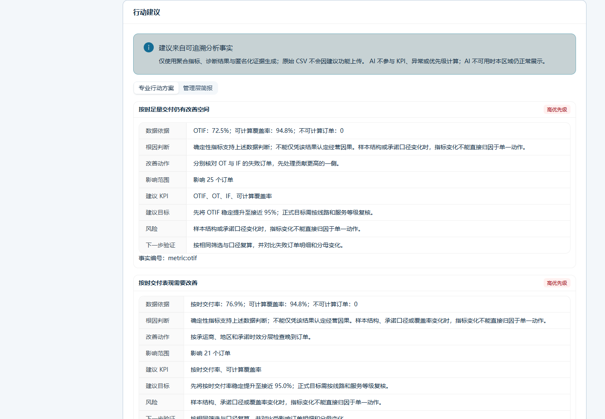
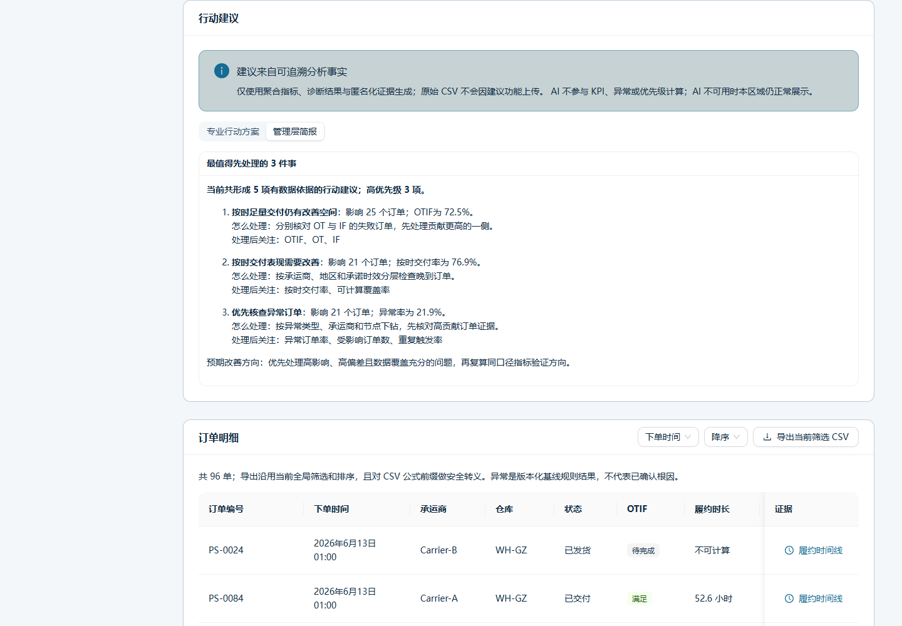

# FulfillLens

[English](README_EN.md) · [文档索引](docs/README.md) · [10 分钟快速体验](#10-分钟快速体验) · [贡献](CONTRIBUTING.md) · [安全](SECURITY.md)

FulfillLens 是面向物流管理专业学生、教师和中小电商商家的本地优先开源履约分析工具。用户导入订单、仓库作业和物流轨迹 CSV/XLSX 后，可以完成字段映射、状态标准化、指标计算、瓶颈分析、透明异常诊断、What-if 情景模拟和报告导出。

项目的核心不是“自动讲一个听起来合理的故事”，而是让每个百分比、异常和模拟结果都能回到字段、公式、阈值、样本和具体订单证据。

> 当前正式版本：`1.1.1`。用户不需要提前把 CSV/XLSX 改成 FulfillLens 标准列名：保留“自动识别（推荐）”，上传文件后点击“一键整理并分析”，系统会综合表头、值画像、列间关系和数据契约处理高置信映射、安全内部 ID、未知状态和非分析列；只有会改变业务含义的关键歧义才要求一次确认。Cloudflare 在线版在浏览器内解析、校验并分析自主文件，原始文件和标准化行不上传到 Worker。详见[项目状态](#项目状态与已知限制)。

## 为什么使用 FulfillLens

- **本地优先**：默认在用户设备上处理文件，不要求外部数据库或付费物流接口。
- **口径透明**：OT、IF、OTIF、P50、P90、覆盖率等均展示字段依赖、分子、分母和警告。
- **证据可追溯**：诊断区分事实、规则判断、可能原因和建议核查，可下钻到订单时间线。
- **模拟不冒充预测**：改进方案在订单/事件层应用可解释变换后重算，显著标注为情景估算。
- **适合教学**：提供三套固定种子合成案例、案例教材和无需真实数据的完整流程。
- **安全可验证**：包含文件安全、隐私清理、公式注入防护、自动化测试、性能和可访问性基线。

## 截图与演示

以下图片由仓库脚本从真实生产构建自动拍摄，全部使用固定合成数据；拍摄条件和校验见[截图与 GIF 清单](docs/SCREENSHOTS.md)。

| 自主导入与字段映射                                                                       | 分析总览                                                                              |
| ---------------------------------------------------------------------------------------- | ------------------------------------------------------------------------------------- |
|  |  |

| 异常证据追溯                                                        | What-if 情景对比                                                                |
| ------------------------------------------------------------------- | ------------------------------------------------------------------------------- |
|  |  |

| 专业行动方案                                                               | 管理层简报                                                        |
| -------------------------------------------------------------------------- | ----------------------------------------------------------------- |
|  |  |


启动后打开 <http://127.0.0.1:5173/cases>，可载入“稳定运营”“促销爆单”或“承运商扰动”合成案例。

## 核心能力

| 模块       | 用户可以完成什么                                        | 重要边界                               |
| ---------- | ------------------------------------------------------- | -------------------------------------- |
| 数据导入   | 导入非模板 CSV/XLSX、识别业务别名、映射/忽略源列并校验  | 忽略与未识别分开；必填字段不能被绕过   |
| 状态标准化 | 保存原始状态、标准状态、来源和置信度，增加项目级映射    | 未知状态保留并标记 `unmapped`          |
| 履约指标   | 查看 OT、IF、OTIF、时效、节点、取消、退回、异常和覆盖率 | 不可计算订单不混入成功/失败分母        |
| 分析总览   | 趋势、分布、节点耗时、仓库/承运商/地区对比和订单明细    | 图表显示样本量、单位、覆盖率和文字摘要 |
| 异常诊断   | 八类透明规则、严重度、帕累托、流程变体、订单证据        | 可能原因不是已证实因果                 |
| 行动建议   | 查看专业行动方案和管理层简报，按证据与优先级安排核查    | 两种视图共享同一事实；AI 不计算 KPI    |
| What-if    | 改善仓内、揽收等待、承运商比例和承诺时效，查看敏感性    | 情景估算，不代表预测或保证             |
| 教学案例   | 一键载入三套完全合成案例并完成分析、诊断和模拟          | 不含真实个人、企业或运单数据           |
| 报告与导出 | 预览并导出 Markdown、自包含 HTML 和安全 CSV             | PDF 尚未达到发布准入；敏感字段默认排除 |
| 本地清理   | 查看并删除数据集及可识别的关联文件、方案和报告任务      | 删除不可恢复，需要二次确认             |

## 适用与不适用场景

适合：

- 物流管理课程、作业、案例教学和指标复算；
- 中小商家对导出订单、仓库和物流轨迹进行离线诊断；
- 学习数据质量、分母、分位数、异常规则和情景模拟；
- 需要可审查、可复现分析流程的开源实践。

不适合：

- 完整 WMS、TMS、ERP、库存或财务系统；
- 实时车辆定位、快递下单、付费轨迹接口或自动调度；
- 多租户计费、生产级权限体系或云端长期托管；
- 用大模型替代指标公式、规则证据或经营因果验证；
- 把情景模拟当作真实预测、承诺或投资/经营保证。

## 10 分钟快速体验

### 1. 准备环境

- Node.js `>=22.12 <25`
- npm `>=10`
- Python `>=3.11`
- Docker Compose 可选

Windows PowerShell：

```powershell
npm.cmd ci
python -m venv apps/api/.venv
.\apps\api\.venv\Scripts\Activate.ps1
python -m pip install -r apps/api/requirements-dev.txt
```

macOS/Linux：

```bash
npm ci
python -m venv apps/api/.venv
source apps/api/.venv/bin/activate
python -m pip install -r apps/api/requirements-dev.txt
```

### 2. 启动本地开发

激活虚拟环境后：

```powershell
npm run dev
```

打开：

- Web：<http://127.0.0.1:5173>
- API 健康检查：<http://127.0.0.1:8000/health>
- OpenAPI：<http://127.0.0.1:8000/docs>

### 3. 载入合成案例

打开 <http://127.0.0.1:5173/cases>，选择一个案例并确认替换当前分析上下文。推荐顺序：

1. 正常运营：学习指标和字段；
2. 促销爆单：观察仓库拥堵和仓内时长恶化；
3. 承运商异常：追溯揽收、干线和末端长尾。

也可以用命令重新生成并验证静态案例：

```powershell
npm run generate:cases
npm run demo:cases
```

只复验 What-if 三类核心方案时可运行真实演示脚本：

```powershell
python scripts/demo_simulation.py
```

要专门体验现实文件兼容转换，打开 <http://127.0.0.1:5173/import>，点击“非标准订单 CSV 自动转换示例”或“非标准物流 XLSX 自动转换示例”。它们会进入与普通文件相同的上传、工作表、映射、Schema 校验和确认流程，不会绕过校验。

要导入自己的文件，保留默认的“自动识别（推荐）”并点击“自主上传文件”即可。系统会根据列名、内容特征和重复关系判断“订单数据 / 仓库作业数据 / 物流轨迹数据”；高置信度映射与安全内部 ID 自动完成。普通用户点击一次“一键整理并分析”即可批量采用推荐、忽略非必要字段、重新校验并进入当前文件的独立分析会话；只有真正影响指标含义的歧义才会要求一次批量确认。完整字段表位于折叠的“高级字段设置”中，不要求先理解内部 Schema。

### 4. 浏览完整路径

依次打开“分析总览 → 异常诊断 → 方案模拟 → 分析报告”。查看指标解释、筛选承运商、进入异常订单时间线，检查“专业行动方案”和“管理层简报”，再导出 HTML 或 Markdown 报告。

### 5. 运行测试

```powershell
npm run release:check
```

该命令检查格式、静态规则、类型、测试、构建、依赖漏洞、文档链接、发布文件和依赖许可证。性能专项单独运行：

```powershell
python scripts/performance_benchmark.py
```

### 6. 清理数据

优先使用“设置 → 本地数据与隐私”，逐个确认删除。API 运行时也可以执行：

```powershell
$datasets = (Invoke-RestMethod http://127.0.0.1:8000/api/datasets).datasets
$datasets | ForEach-Object {
  Invoke-RestMethod -Method Delete -Uri "http://127.0.0.1:8000/api/datasets/$($_.dataset_id)"
}
```

删除不可恢复。该接口会清理分析行、可识别导入文件、关联方案和报告任务。

## Docker Compose

在已安装 Docker 的环境：

```powershell
docker compose config --quiet
docker compose up --build -d
docker compose ps
```

打开 <http://127.0.0.1:5173>。查看日志与停止：

```powershell
docker compose logs --no-color
docker compose down
```

若确定要同时删除全部持久数据卷：

```powershell
docker compose down --volumes
```

最后一个命令不可恢复。GitHub Actions 的独立 Docker smoke job 会实际构建、启动、检查健康状态并清理数据卷；本机结果以当前发布验收记录为准。

## Cloudflare 在线演示

在线地址：<https://fulfilllens.esthertreu3724.workers.dev>

品牌迁移期间，旧地址 `fulfilllens-cn.esthertreu3724.workers.dev` 暂不删除，作为历史版本回退入口；它不会覆盖上方新地址，也不应作为新文档或书签的首选。新地址完成独立验收后再评估受控跳转。

在线版默认加载公开、确定性的合成案例，可体验指标、总览、透明诊断、订单级 What-if 复算和报告。自主文件路径在浏览器本地完成安全检查、CSV/XLSX 解析、字段建议、状态标准化、Schema、质量校验、指标、诊断、行动建议和报告；原始文件与标准化行不发送到 Cloudflare，确认后的数据集只保存在当前浏览器 IndexedDB，可在“设置”中删除。Worker 的原始上传接口主动拒绝请求，避免旧客户端误传文件。

在线自主导入与公开合成分析仍是两条独立路径：自主数据的指标、诊断、行动建议和报告由浏览器本地引擎生成；自主数据的 What-if 方案管理尚未接入浏览器引擎，需使用关联订单表的本地/Docker 版。公开合成自建方案只保存在 Worker 当前运行期，不是持久业务存储。部署配置在 `wrangler.jsonc`，AI 通过 `AI` binding 调用，Account ID 和 API Token 不进入浏览器或仓库。

```powershell
npm.cmd run build:cloudflare
npm.cmd run test:cloudflare
npm.cmd run deploy:cloudflare
```

部署命令需要在进程环境中提供 Cloudflare 发布凭据；不得把真实令牌写入 `.env`、Wrangler 配置或 Git。能力边界、回滚和验证方法见[Cloudflare 部署说明](docs/CLOUDFLARE_DEPLOYMENT.md)。

## 本地开发

无需 `.env` 即可使用安全默认值。确需覆盖配置时：

```powershell
Copy-Item apps/api/.env.example apps/api/.env
Copy-Item apps/web/.env.example apps/web/.env
```

`.env` 已被忽略，不得提交真实密钥。分别启动：

```powershell
npm run dev:web
npm run dev:api
```

主要命令：

| 命令                     | 作用                                       |
| ------------------------ | ------------------------------------------ |
| `npm run format`         | 格式化前端、Python 和发布文档              |
| `npm run format:check`   | 检查格式但不修改                           |
| `npm run lint`           | ESLint 与 Ruff                             |
| `npm run typecheck`      | TypeScript 与 mypy                         |
| `npm run test`           | Vitest、pytest 和契约测试                  |
| `npm run build`          | 生产构建 Web                               |
| `npm run smoke`          | 临时启动 API/Web 并检查核心路由            |
| `npm run docs:check`     | 检查文档链接、章节、泄露与发布文件         |
| `npm run licenses:check` | 检查依赖许可证阻断项                       |
| `npm run audit`          | npm 与 Python 已知漏洞审计                 |
| `npm run release:check`  | 发布前本地完整质量链，不含 Docker/性能专项 |

更多问题见[故障排查](docs/TROUBLESHOOTING.md)和[常见问题](docs/FAQ.md)。

## 导入格式与数据规则

支持三类数据：

- `orders`：一行一个订单；
- `warehouse_events`：一行一个仓库节点事件；
- `tracking_events`：一行一个物流轨迹事件。

支持 CSV 与 XLSX。CSV 支持 UTF-8、UTF-8 BOM、GBK/GB18030，兼容 CRLF/LF、引号、字段内逗号和空行；无法可靠识别编码时要求用户确认。字段支持中文、英文、camelCase、snake_case 和常见业务表达；映射证据综合 Header、Alias、值画像、唯一性/重复规律及当前数据类型，技术详情默认折叠。XLSX 支持多工作表、Excel 日期、数值/文本数字、空白行与附加列，不执行公式、宏、脚本或外部链接。时间解析不依赖系统 locale，支持中英文月份、显式时区和整列日/月顺序推断；仍有歧义时只询问一次文件级日期顺序，纯日期保留 date-only 精度。自动转换只标准化表达，不补造、删除或篡改业务事实，也不承诺支持任意 Excel。

模板位于 `data/templates/`，机器可读 Schema 位于 `data/schemas/`。完整字段见[数据字典](docs/DATA_DICTIONARY.md)，状态见[状态体系](docs/STATUS_TAXONOMY.md)，导入限制见[导入规范](docs/IMPORTING.md)。

默认文件保护包括扩展名/MIME/大小、XLSX 解压规模、行列数、长文本、文件名和路径检查；不执行 Excel 宏和公式。导出 CSV 对 `= + - @` 前缀安全转义。

## 技术架构

```text
React + TypeScript + Vite + Ant Design + ECharts
                       │ /api、/health
                       ▼
FastAPI + Pydantic ── 领域服务与透明规则
        │                    │
        ├─ DuckDB：订单/事件分析数据
        ├─ SQLite：数据集与方案控制元数据
        └─ 本地临时文件：导入/报告任务（可清理）
```

- `apps/web`：响应式中文 Web 与 API client；
- `apps/api`：导入、指标、诊断、模拟、案例、报告和清理 API；
- `data`：Schema、模板、规则和完全合成案例；
- `docs`：产品、口径、架构、风险、教学和发布资料；
- `tests`：后端、前端、契约、端到端、安全和性能验证。

完整说明见[架构文档](docs/ARCHITECTURE.md)和[ADR](docs/adr/README.md)。Cloudflare 在线版由浏览器本地导入引擎与公开合成分析 Worker 共同组成；当前 FastAPI/DuckDB/SQLite 后端仍不能零修改部署，见[部署与可行性说明](docs/CLOUDFLARE_DEPLOYMENT.md)。

## 项目状态与已知限制

阶段 0–12、v1.0.0 正式发布、v1.1.0 新手导入优化及 v1.1.1 数据口径修复已完成。当前版本让项目自带 CSV/XLSX 重新上传后直接进入分析，修复时长分布空白和样本不一致，并明确分列展示原始记录、有效记录、物流事件、唯一运单、唯一业务订单及当前分析实体。用户文件不会自动混入演示/兼容样例；切换文件会重新计算总览、诊断、建议和报告。当前证据：

- 前端 108 项、Cloudflare Worker 14 项、后端与契约 235 项测试；
- 1 万/5 万订单性能基准；
- 导入流程已在 360/390/430/1440 Chromium 真实操作；全站审计覆盖 360/390/430/768/1440；
- npm/Python 漏洞审计和敏感信息扫描；
- [GitHub Actions](https://github.com/autumnnmutua/fulfilllens/actions)包含质量与真实 Docker smoke job；发布标签以对应提交的实际成功结果为准；
- 公开远程仓库与 Private Vulnerability Reporting 已启用。

正式版本的非阻断限制：

- Firefox/Safari；
- PDF 中文字体、分页和长表；
- Cloudflare 浏览器自有数据的 What-if 方案管理尚未接入本地浏览器引擎；
- Cloudflare 身份权限、跨设备持久化和异步大文件链路。

报告和基准是特定代码、数据和机器条件下的证据，不是对所有硬件或业务数据的保证。

## 路线图

- 阶段 0–4：仓库、产品/数据契约、工程骨架、导入与指标；
- 阶段 5–9：仪表盘、诊断、模拟、案例和报告；
- 阶段 10：安全、性能、回归、移动端和可访问性；
- 阶段 11：中英文开源文档、许可证、治理模板和 RC 资料；
- 阶段 12：干净环境全量验收与 v1.0 发布判断。

详见[路线图](docs/ROADMAP.md)、[最终验收记录](docs/RELEASE_ACCEPTANCE.md)、[兼容性验证报告](docs/COMPATIBILITY_VALIDATION.md)、[v1.0.0 发布说明](docs/releases/v1.0.0.md)、[v1.1.0 发布说明](docs/releases/v1.1.0.md)和[v1.1.1 发布说明](docs/releases/v1.1.1.md)。

## 隐私、安全与免责声明

- 示例、教材和报告样例全部由固定种子程序生成；
- 姓名、手机号、详细地址、身份证等只提示风险，不写入日志；
- 报告默认排除敏感字段，订单标识需要二次确认；
- Cloudflare 自主导入的原始文件只在浏览器内存中处理，确认后的标准化数据只保存在当前浏览器 IndexedDB；
- Workers AI 默认关闭，不读取导入数据，也不参与指标或规则；
- 真实凭据只允许放在被忽略的本机 `.env`，曾出现在聊天或日志中的凭据应立即轮换；
- 使用者负责确认字段语义、时区、数量单位、承诺口径、覆盖率和阈值。

本软件按 MIT 许可证“原样”提供，不保证无错误、适合特定用途、经营效果或数据结论。异常诊断是规则判断，可能原因需要进一步核查；What-if 结果是情景估算，不代表预测、因果证明或服务保证。

安全问题请阅读 [SECURITY.md](SECURITY.md)。

## 文档

- [产品需求](docs/PRD.md)
- [指标口径](docs/METRICS.md)
- [数据字典](docs/DATA_DICTIONARY.md)
- [状态体系](docs/STATUS_TAXONOMY.md)
- [导入规范](docs/IMPORTING.md)
- [诊断规范](docs/DIAGNOSTICS.md)
- [模拟说明](docs/SIMULATION.md)
- [案例教材](docs/case-studies/README.md)
- [报告规范](docs/REPORTING.md)
- [架构与 ADR](docs/ARCHITECTURE.md)
- [FAQ](docs/FAQ.md)
- [故障排查](docs/TROUBLESHOOTING.md)
- [依赖许可证](docs/DEPENDENCY_LICENSES.md)
- [完整文档索引](docs/README.md)

## 贡献

欢迎错误修复、测试、字段别名、状态映射、教学案例和文档改进。提交前请阅读 [CONTRIBUTING.md](CONTRIBUTING.md)和[社区行为准则](CODE_OF_CONDUCT.md)。

Issue 和 PR 只能附完全合成且已脱敏的数据。指标、规则、Schema、模拟或新依赖变化必须说明口径、风险、许可证和验收证据。

## 许可证

FulfillLens 使用 [MIT License](LICENSE)。第三方依赖保留各自许可证，审查结论和 MPL/CC/Apache 注意事项见[依赖许可证审查](docs/DEPENDENCY_LICENSES.md)。

引用教学或研究使用时可使用 [CITATION.cff](CITATION.cff)。
