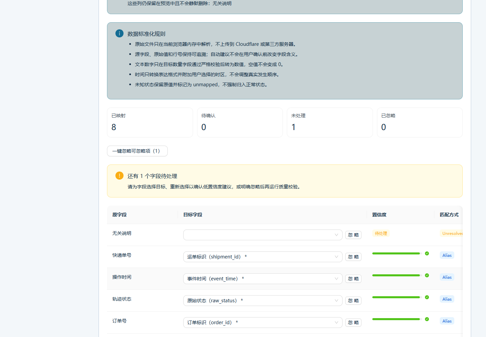
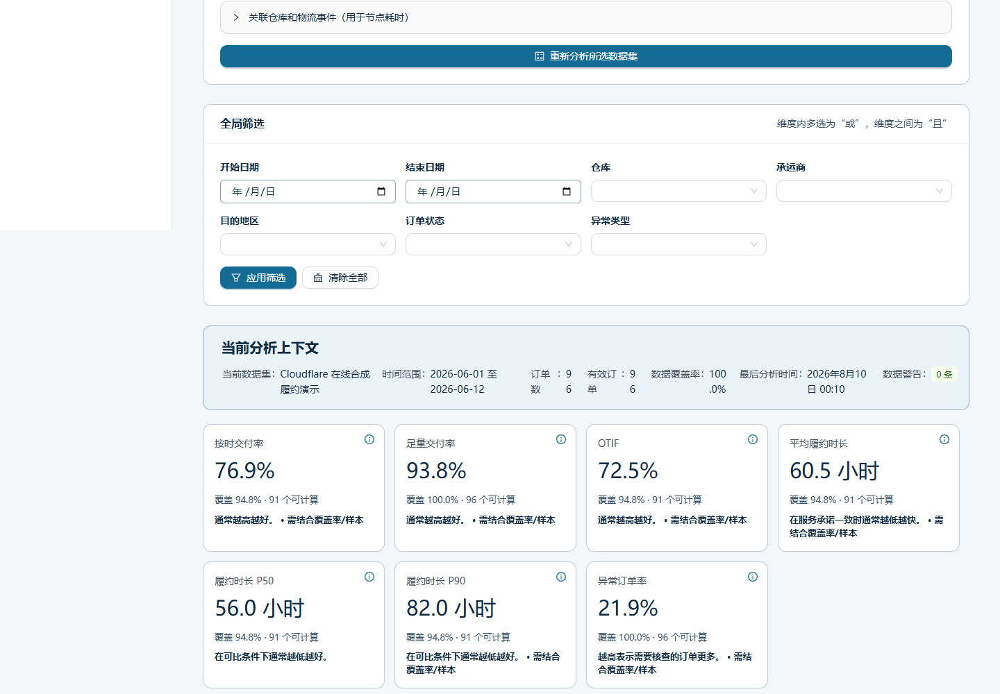
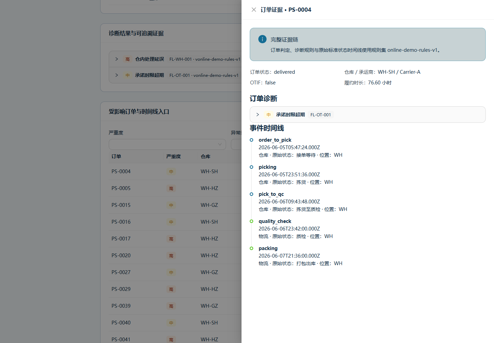
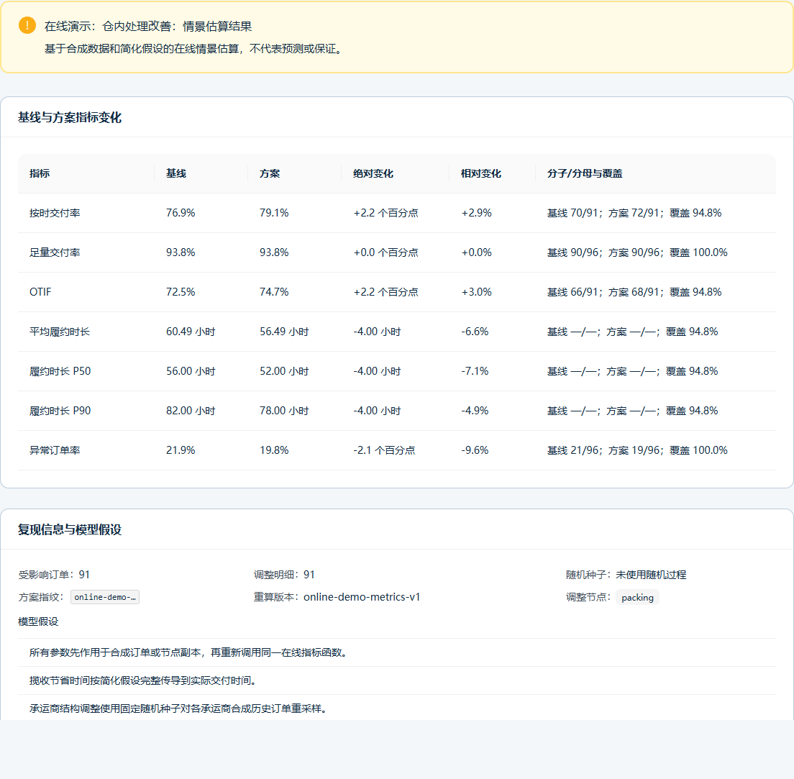
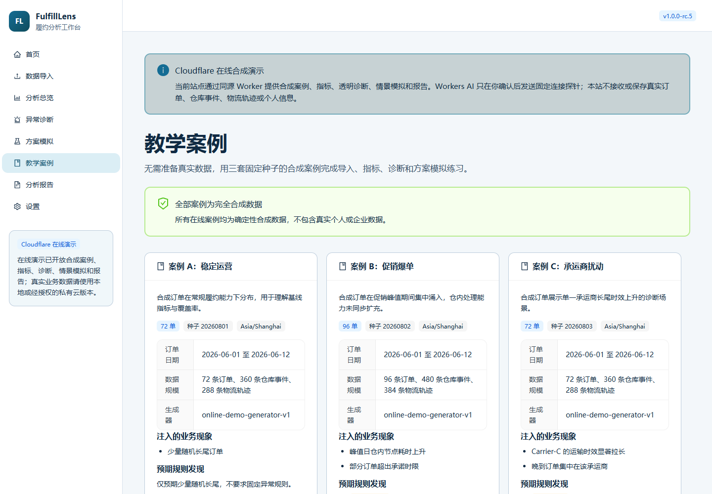

# FulfillLens

[简体中文](README.md) · [Documentation](docs/README.md) · [10-minute quick experience](#10-minute-quick-experience) · [Contributing](CONTRIBUTING.md) · [Security](SECURITY.md)

FulfillLens is a local-first, open-source fulfillment analytics tool for logistics students, instructors, and small or medium-sized e-commerce businesses. Users import order, warehouse-operation, and tracking CSV/XLSX files, then map fields, normalize statuses, calculate fulfillment metrics, inspect bottlenecks, run transparent anomaly rules, simulate What-if scenarios, and export reports.

The project is designed to make every percentage, anomaly, and scenario traceable to fields, formulas, thresholds, samples, and order-level evidence instead of generating a merely plausible story.

> Version status: `1.0.0-rc.5` unifies the public brand as FulfillLens and further hardens real-world file compatibility. Suggestions combine normalized headers, a shared business alias catalog, and limited value profiling. A conservative, undoable bulk action ignores only clearly non-analytical columns; required and plausible critical candidates remain protected. The Cloudflare edition still parses and validates custom CSV/XLSX files locally in the browser and does not upload raw files to the Worker. See [Project status](#project-status-and-known-limitations).

## Why FulfillLens

- **Local first:** files are processed on the user's device by default, with no external database or paid carrier API required.
- **Transparent definitions:** OT, IF, OTIF, P50, P90, and coverage expose field dependencies, numerator, denominator, and warnings.
- **Traceable evidence:** diagnostics separate facts, rule judgements, possible causes, and recommended checks, with order timelines.
- **Scenarios are not predictions:** explainable transformations are applied at order/event level before metrics are recalculated.
- **Ready for teaching:** three deterministic synthetic cases and course materials work without real operational data.
- **Verifiable quality:** file safety, privacy cleanup, formula-injection protection, automated tests, performance, and accessibility baselines are included.

## Screenshots and demo

The following images are captured reproducibly from the real production build with deterministic synthetic data. See the [Screenshot and GIF checklist](docs/SCREENSHOTS.md) for capture and privacy controls.

| Custom import and mapping                                                                                             | Analytics dashboard                                                                                 |
| --------------------------------------------------------------------------------------------------------------------- | --------------------------------------------------------------------------------------------------- |
|  |  |

| Diagnostic evidence                                                                         | What-if comparison                                                                                    |
| ------------------------------------------------------------------------------------------- | ----------------------------------------------------------------------------------------------------- |
|  |  |



Start the project, open <http://127.0.0.1:5173/cases>, and load Stable Operations, Promotion Surge, or Carrier Disruption.

## Core capabilities

| Module               | What users can do                                                                   | Important boundary                                                         |
| -------------------- | ----------------------------------------------------------------------------------- | -------------------------------------------------------------------------- |
| Data import          | Convert non-template CSV/XLSX, map or ignore source columns, and validate           | Ignored and unresolved differ; required fields cannot be bypassed          |
| Status normalization | Keep raw/normalized status, source, confidence, and project mappings                | Unknown values remain available as `unmapped`                              |
| Fulfillment metrics  | Calculate OT, IF, OTIF, duration, node, cancellation, return, anomaly, and coverage | Non-computable orders are not counted as success or failure                |
| Dashboard            | Explore trends, distributions, nodes, dimensions, and paginated orders              | Charts show units, sample size, coverage, and text summaries               |
| Diagnostics          | Use eight transparent rule categories, severity, Pareto, variants, and evidence     | Possible causes are not proven causality                                   |
| What-if              | Change warehouse time, pickup wait, carrier mix, or promise strategy                | Scenario estimates are not forecasts or guarantees                         |
| Teaching cases       | Load three fully synthetic cases and follow guided exercises                        | No real person, company, address, or tracking number is used               |
| Reports              | Preview/export Markdown, self-contained HTML, and safe CSV                          | PDF has not met its release gate; sensitive fields are excluded by default |
| Local cleanup        | List and delete datasets, identifiable artifacts, scenarios, and report jobs        | Deletion is irreversible and requires confirmation                         |

## Suitable and unsuitable use cases

Suitable for:

- logistics education, assignments, case studies, and hand-recalculated metrics;
- offline analysis of exported order, warehouse, and tracking data for smaller merchants;
- learning data quality, denominators, percentiles, anomaly rules, and scenarios;
- open-source workflows that need reviewable, reproducible analysis.

Not suitable for:

- a complete WMS, TMS, ERP, inventory, or accounting system;
- live vehicle tracking, carrier booking, paid tracking APIs, or automatic dispatch;
- multi-tenant billing, production authorization, or long-term cloud hosting;
- replacing metric formulas, evidence, or causal validation with an LLM;
- treating scenario output as a forecast, commitment, or business guarantee.

## 10-minute quick experience

### 1. Prepare the environment

- Node.js `>=22.12 <25`
- npm `>=10`
- Python `>=3.11`
- Docker Compose is optional

Windows PowerShell:

```powershell
npm.cmd ci
python -m venv apps/api/.venv
.\apps\api\.venv\Scripts\Activate.ps1
python -m pip install -r apps/api/requirements-dev.txt
```

macOS/Linux:

```bash
npm ci
python -m venv apps/api/.venv
source apps/api/.venv/bin/activate
python -m pip install -r apps/api/requirements-dev.txt
```

### 2. Start local development

With the Python environment active:

```powershell
npm run dev
```

Open:

- Web: <http://127.0.0.1:5173>
- API health: <http://127.0.0.1:8000/health>
- OpenAPI: <http://127.0.0.1:8000/docs>

### 3. Load a synthetic case

Open <http://127.0.0.1:5173/cases>, select a case, and confirm replacing the current browser analysis context. Recommended order:

1. Normal Operations for basic fields and metrics;
2. Promotion Surge for warehouse congestion and degraded handling time;
3. Carrier Disruption for pickup, line-haul, and last-mile tails.

Regenerate and validate the committed cases with:

```powershell
npm run generate:cases
npm run demo:cases
```

To verify only the three core What-if scenarios, run the real demo script:

```powershell
python scripts/demo_simulation.py
```

To focus on real-world compatibility conversion, open <http://127.0.0.1:5173/import> and choose “Non-standard order CSV auto-conversion sample” or “Non-standard logistics XLSX auto-conversion sample.” Both use the ordinary upload, sheet selection, mapping, Schema validation, and confirmation flow.

To import your own file, select Orders, Warehouse Events, or Tracking Events, then choose “Upload your own file.” The existing seven-step wizard opens the system picker; step 2 also supports click or drag-and-drop for `.csv` and `.xlsx` only.

### 4. Follow the full path

Open Dashboard → Diagnostics → What-if Scenarios → Reports. Read metric definitions, filter a carrier, open an anomalous order timeline, copy a scenario, and export the guided HTML report.

### 5. Run tests

```powershell
npm run release:check
```

This checks formatting, linting, types, tests, build, dependency vulnerabilities, documentation links, release files, and dependency licenses. Run the performance benchmark separately:

```powershell
python scripts/performance_benchmark.py
```

### 6. Clean local data

Prefer Settings → Local data and privacy, and confirm each deletion. With the API running, PowerShell can delete all listed datasets:

```powershell
$datasets = (Invoke-RestMethod http://127.0.0.1:8000/api/datasets).datasets
$datasets | ForEach-Object {
  Invoke-RestMethod -Method Delete -Uri "http://127.0.0.1:8000/api/datasets/$($_.dataset_id)"
}
```

Deletion is irreversible and removes analytical rows, identifiable import artifacts, linked scenarios, and report jobs.

## Docker Compose

On a machine with Docker:

```powershell
docker compose config --quiet
docker compose up --build -d
docker compose ps
```

Open <http://127.0.0.1:5173>. Inspect and stop with:

```powershell
docker compose logs --no-color
docker compose down
```

To intentionally delete the persistent volume as well:

```powershell
docker compose down --volumes
```

The last command is irreversible. A separate GitHub Actions Docker smoke job builds, starts, health-checks, and removes the Compose stack and its CI volume; local results are recorded in the current release evidence.

## Cloudflare online demo

Online URL: <https://fulfilllens.esthertreu3724.workers.dev>

During the brand migration, the legacy `fulfilllens-cn.esthertreu3724.workers.dev` deployment is retained as a historical rollback entry. It does not replace the new primary URL above and should not be used in new documentation or bookmarks. A controlled redirect can be evaluated only after independent validation of the new address.

The online edition loads public deterministic synthetic cases and supports metrics, dashboards, transparent diagnostics, order-level What-if recalculation, and reports. Its custom-file path performs extension/MIME/signature checks, CSV/XLSX parsing, field suggestions, status normalization, Schema validation, and quality checks in the browser. Raw files are not sent to Cloudflare; after confirmation, only normalized datasets remain in this browser's IndexedDB and can be deleted in Settings. The Worker upload endpoint rejects raw bodies to protect older clients from accidental uploads.

Custom browser imports and public synthetic analysis are currently separate paths: this release does not send user datasets to the Worker, so full metrics, diagnostics, simulation, and report processing for them still require the local or Docker edition. User-created online scenarios remain runtime-only. `wrangler.jsonc` binds Workers AI as `AI`; the Account ID and API token never enter browser assets or the repository.

```powershell
npm.cmd run build:cloudflare
npm.cmd run test:cloudflare
npm.cmd run deploy:cloudflare
```

Deployment credentials must be supplied through the process environment and must not be committed to `.env`, Wrangler configuration, or Git. See the [Cloudflare deployment notes](docs/CLOUDFLARE_DEPLOYMENT.md) for boundaries, rollback, and verification.

## Local development

Safe defaults work without `.env`. Copy examples only when overrides are needed:

```powershell
Copy-Item apps/api/.env.example apps/api/.env
Copy-Item apps/web/.env.example apps/web/.env
```

`.env` is ignored and real secrets must never be committed. Start services separately with:

```powershell
npm run dev:web
npm run dev:api
```

Important commands:

| Command                  | Purpose                                                           |
| ------------------------ | ----------------------------------------------------------------- |
| `npm run format`         | Format front end, Python, and release documents                   |
| `npm run format:check`   | Check formatting without writes                                   |
| `npm run lint`           | Run ESLint and Ruff                                               |
| `npm run typecheck`      | Run TypeScript and mypy                                           |
| `npm run test`           | Run Vitest, pytest, and contract tests                            |
| `npm run build`          | Build the production web app                                      |
| `npm run smoke`          | Start temporary API/Web processes and check core routes           |
| `npm run docs:check`     | Validate links, sections, leaks, and release files                |
| `npm run licenses:check` | Block incompatible or unknown direct licenses                     |
| `npm run audit`          | Audit npm and Python vulnerabilities                              |
| `npm run release:check`  | Run the local release quality chain, excluding Docker/performance |

See [Troubleshooting](docs/TROUBLESHOOTING.md) and [FAQ](docs/FAQ.md).

## Import formats and data rules

Three data types are supported:

- `orders`: one row per order;
- `warehouse_events`: one row per warehouse event;
- `tracking_events`: one row per tracking event.

CSV and XLSX are supported. CSV handles UTF-8, UTF-8 BOM, GBK/GB18030, CRLF/LF, quoted fields, embedded commas, and blank lines; uncertain encoding requires user confirmation. Fields may use Chinese, English, camelCase, snake_case, or registered business-system aliases. The UI exposes source, target, Exact/Alias/Normalized/Similarity/Manual method, confidence, and confirmation status. XLSX supports multiple sheets, Excel dates, numeric/text numeric cells, blank rows, and extra columns; formulas, macros, scripts, and external links are not executed. Times are normalized to timezone-aware ISO 8601, and timezone-less inputs require a selected default timezone. Conversion only normalizes representation—it does not invent, delete, or alter business facts and does not claim to support every Excel workbook.

Templates live in `data/templates/`, and machine-readable schemas live in `data/schemas/`. See the [Data Dictionary](docs/DATA_DICTIONARY.md), [Status Taxonomy](docs/STATUS_TAXONOMY.md), and [Import Guide](docs/IMPORTING.md).

Default protections cover extension/MIME/size, XLSX expanded size, rows/columns, long text, file names, and paths. Excel macros and formulas are not executed. CSV values beginning with `= + - @` are escaped on export.

## Technical architecture

```text
React + TypeScript + Vite + Ant Design + ECharts
                       │ /api, /health
                       ▼
FastAPI + Pydantic ── domain services and transparent rules
        │                    │
        ├─ DuckDB: order/event analytical data
        ├─ SQLite: dataset/scenario control metadata
        └─ local temporary files: import/report jobs (cleanable)
```

- `apps/web`: responsive Chinese-first web UI and API client;
- `apps/api`: import, metrics, diagnostics, simulation, cases, reports, and cleanup APIs;
- `data`: schemas, templates, rules, and fully synthetic cases;
- `docs`: product, metrics, architecture, risks, teaching, and release materials;
- `tests`: backend, frontend, contract, end-to-end, security, and performance verification.

See [Architecture](docs/ARCHITECTURE.md) and [ADRs](docs/adr/README.md). The Cloudflare edition combines a browser-local import engine with a Worker adapter for public synthetic analysis; the current FastAPI/DuckDB/SQLite backend still cannot be deployed unchanged. See the [Cloudflare deployment and feasibility notes](docs/CLOUDFLARE_DEPLOYMENT.md).

## Project status and known limitations

Stages 0–12 are complete for this release-candidate scope, including full local acceptance. Current evidence includes:

- 37 frontend, 14 Cloudflare Worker, and 229 backend/contract tests;
- 10,000/50,000-order performance benchmarks;
- real import interaction at 360/390/430/1440 Chromium, plus site-wide 360/390/430/768/1440 audits;
- npm/Python vulnerability audits and repository secret scans;
- [GitHub Actions](https://github.com/autumnnmutua/fulfilllens/actions) includes quality and real Docker smoke jobs; the release tag is governed by the actual result for its commit;
- the public remote repository and Private Vulnerability Reporting are enabled.

Non-blocking release-candidate limitations:

- Firefox and Safari;
- PDF Chinese fonts, pagination, and long tables;
- Worker analytics/diagnostics/simulation/reports for browser-owned Cloudflare datasets;
- Cloudflare identity/authorization, cross-device persistence, and asynchronous large-file workflows.

Reports and benchmarks are evidence for a specific revision, dataset, and machine—not guarantees for every hardware or business dataset.

## Roadmap

- Stages 0–4: repository, product/data contracts, engineering skeleton, import, and metrics;
- Stages 5–9: dashboard, diagnostics, simulation, cases, and reports;
- Stage 10: security, performance, regression, mobile, and accessibility;
- Stage 11: bilingual open-source docs, license, governance templates, and RC assets;
- Stage 12: clean-environment acceptance and the v1.0 release decision.

See the [Roadmap](docs/ROADMAP.md), [final acceptance record](docs/RELEASE_ACCEPTANCE.md), [compatibility validation report](docs/COMPATIBILITY_VALIDATION.md), and [v1.0.0-rc.5 release notes](docs/releases/v1.0.0-rc.5.md).

## Privacy, security, and disclaimer

- examples, lessons, and sample reports are generated with deterministic synthetic data;
- names, phone numbers, detailed addresses, and identity numbers are risk indicators and are not written to logs;
- reports exclude sensitive fields by default, and order identifiers require a second confirmation;
- Cloudflare custom imports keep raw files in browser memory and store confirmed normalized datasets only in this browser's IndexedDB;
- Workers AI is disabled by default, does not read imported data, and does not calculate metrics or rules;
- real secrets belong only in ignored local `.env` files; credentials exposed in chat or logs must be rotated;
- users must validate field meaning, timezone, quantity unit, promise definition, coverage, and rule thresholds.

The software is provided “as is” under the MIT License, without a guarantee of correctness, fitness, or business outcome. Diagnostics are rule judgements; possible causes require further checks. What-if results are scenario estimates, not forecasts, causal proof, or service guarantees.

Read [SECURITY.md](SECURITY.md) before reporting a security issue.

## Documentation

- [Product requirements](docs/PRD.md)
- [Metric definitions](docs/METRICS.md)
- [Data dictionary](docs/DATA_DICTIONARY.md)
- [Status taxonomy](docs/STATUS_TAXONOMY.md)
- [Import guide](docs/IMPORTING.md)
- [Diagnostics](docs/DIAGNOSTICS.md)
- [Simulation](docs/SIMULATION.md)
- [Teaching cases](docs/case-studies/README.md)
- [Reporting](docs/REPORTING.md)
- [Architecture and ADRs](docs/ARCHITECTURE.md)
- [FAQ](docs/FAQ.md)
- [Troubleshooting](docs/TROUBLESHOOTING.md)
- [Dependency licenses](docs/DEPENDENCY_LICENSES.md)
- [Full documentation index](docs/README.md)

## Contributing

Bug fixes, tests, mapping aliases, status mappings, teaching cases, and documentation improvements are welcome. Read [CONTRIBUTING.md](CONTRIBUTING.md) and the [Code of Conduct](CODE_OF_CONDUCT.md) first.

Issues and PRs may contain only fully synthetic, redacted data. Changes to metrics, rules, schemas, simulations, or dependencies must document definitions, risks, licenses, and acceptance evidence.

## License

FulfillLens is licensed under the [MIT License](LICENSE). Third-party dependencies retain their own licenses; MPL, CC, and Apache notices are documented in the [dependency license review](docs/DEPENDENCY_LICENSES.md).

For teaching or research citation, use [CITATION.cff](CITATION.cff).
