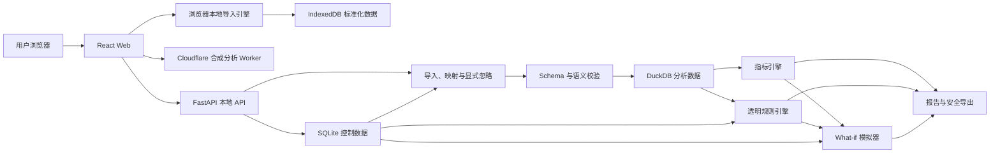

# FulfillLens 架构说明

- 文档状态：阶段 8 已实现，持续演进
- 架构版本：architecture-v1.8-draft
- 更新日期：2026-08-09

## 1. 架构目标

FulfillLens 采用本地优先的模块化单体架构，在一台普通电脑上完成数据导入、清洗、分析、诊断、模拟和导出。架构首先保证：

1. 指标、状态、规则和模拟可追溯；
2. 用户数据默认不离开本机；
3. 三类标准表和口径只有一个来源；
4. 学生、教师和中小商家能够低成本运行；
5. 模块可单独测试，但不为 MVP 提前拆成微服务。

## 2. 约束

- Web：React、TypeScript、Vite；
- API：FastAPI、Python、Pydantic；
- 数据处理：Python 纯函数指标内核与 DuckDB；Pandas 预留给后续批量变换，不是当前指标公式依赖；
- 本地控制数据：SQLite；
- 前后端通过版本化 HTTP/JSON 契约通信；
- 简体中文为默认语言，保留 i18n；
- 原始导入、本地数据库、日志和导出文件不进入 Git；
- 核心导入与指标不依赖外部付费接口、远程数据库或云端身份系统；
- 可选外部 AI 连接默认关闭，不进入指标数据流，且只能由显式确认的固定合成探针触发；
- Cloudflare 在线自主导入使用浏览器本地引擎，原始文件不进入 Worker；公开合成分析仍走同源 Worker API；
- 阶段 7 已实现安全导入、DuckDB/SQLite 数据集存储、纯函数指标引擎、统一筛选仪表盘、版本化诊断规则、订单事件证据下钻和可复现 What-if 模拟；教学案例和报告页面仍明确显示“开发中”。

## 3. 逻辑组件



### 3.1 Web 应用

职责：

- 文件选择、工作表/编码选择、自动数据类型、数据预览，以及可区分 mapped/generated/inferred/ignored/unresolved/blocking 的字段映射；HIGH 自动应用、MEDIUM 一次批量采用，安全批量忽略只作用于已满足关键契约后的非分析列并支持撤销；
- 在 Cloudflare 构建中执行文件安全检查、CSV/XLSX 解析、标准化、Schema/质量校验，并把确认结果保存在浏览器 IndexedDB；
- 数据质量、指标、图表、异常、订单时间线、模拟和报告交互；
- 展示口径、覆盖率、版本、错误和警告；
- 响应式布局、键盘访问和 i18n。

不负责：

- 在浏览器复制核心指标公式；
- 直接读取本地数据库文件；
- 用静态数字模拟 API 成功；
- 存储真实密钥或长期保存原始导入数据。

### 3.2 FastAPI

职责：

- 文件上传和本地任务生命周期；
- 字段/状态映射、显式忽略、稳定事件 ID 派生、Schema 和语义校验；
- 数据集、指标、诊断、模拟和报告 API；
- 统一错误格式、版本信息和健康检查；
- 调用领域模块并管理本地存储边界。

不负责：

- 在路由函数中堆叠指标公式；
- 把文件原值写入普通日志；
- 在未授权情况下调用外部服务；
- 将 SQLite/DuckDB 表结构直接暴露给前端。

Web 与 FastAPI 共用 `data/schemas/import_field_catalog.json` 的标准字段别名和辅助证据名称，以及 `data/schemas/status_keyword_rules.json` 的可审查状态关键词规则。两端可分别实现运行时细节，但同一输入的字段语义、时间歧义策略、状态代码和异常空值必须由契约测试保持一致。

### 3.3 领域与分析模块

阶段 5 的实际边界：

```text
apps/api/app/
├─ imports/          # 安全导入、映射、状态标准化和质量校验
├─ datasets/         # DuckDB 明细与 SQLite 控制元数据
├─ metrics/          # 纯函数指标、稳定模型和应用服务
├─ dashboard/        # 一致筛选、节点/维度编排、订单分页和安全导出
├─ diagnostics/      # 版本化规则、证据、去重、帕累托、路径和订单追溯
├─ simulation/       # 只读基线、订单/事件变换、经验重采样、方案存储和敏感性
└─ api/routes/       # 薄 HTTP 路由

packages/            # 后续确有跨应用复用时再提取共享契约
```

计算和数据规则归属 Python；前端只消费稳定结果，不复制核心公式。

## 4. 数据流

本地 FastAPI/Docker 数据流：

1. 用户选择本地 CSV/XLSX；
2. API 将文件放入任务级安全临时目录；
3. 解析器只读取数据，不执行宏、公式或脚本；
4. 用户确认编码、工作表、字段和默认时区；
5. 映射器生成三类标准行并保留原始列/状态上下文；
6. JSON Schema 验证单行结构；
7. 语义校验检查唯一性、外键、时间顺序、数量和状态转换；
8. 阻断错误进入质量报告；合格标准数据先写入任务级 JSONL，确认后删除上传源文件；
9. 确认时把标准行写入 DuckDB 固定类型表，并在 SQLite 登记数据集类型、来源任务、行数和契约版本；
10. 指标、诊断和模拟从同一标准数据与版本化配置计算；
11. 报告层使用同一结果模型导出，并默认排除敏感字段；
12. 用户可清理数据集及其派生本地文件。

Cloudflare 浏览器自主导入数据流：

1. 用户保留自动识别或手动指定三类数据之一，点击“自主上传文件”或在第 2 步拖拽 `.csv` / `.xlsx`；
2. 浏览器检查扩展名、MIME、文件签名、10 MiB 上限和 XLSX 解压安全限制；
3. 浏览器在内存中解析编码/工作表、字段、Excel 日期和原始标识，不执行宏、公式、脚本或外部链接；日期采用确定性语法和整列 DMY/MDY 推断，纯日期保留精度；
4. 类型与字段识别组合 Header/Alias、值画像、唯一性/重复关系和当前数据契约；技术证据默认折叠，普通用户只做批量操作；
5. 同一字段目录、Schema 和状态代码文件驱动字段建议与质量校验，用户可返回修改映射；
6. 仅在最新校验可确认时写入 IndexedDB，随后释放原始 `File` 引用；取消时直接释放；
7. 设置页列出并删除浏览器本地数据。原始文件和标准化行都不发送到 Cloudflare；
8. 确认后的浏览器自有数据由纯 TypeScript 本地引擎计算指标、诊断、行动建议和报告；公开合成案例继续使用 Worker 数据流。当前浏览器自有数据不支持 What-if，两个上下文不混用；
9. 行动建议先从确定性的指标与诊断生成共享 facts，再渲染专业行动方案和管理层简报；原始行不会为生成建议而发送给 AI。

可选 Workers AI 连接是独立旁路：状态接口只返回脱敏配置；探针不读取上述导入数据，只发送版本化固定合成短句。未来若用模型优化建议表达，输入只能是经确认、最小化、匿名化的 recommendation facts，并保持确定性模板兜底；不能复用探针接口绕过数据边界。

## 5. 数据契约层次

| 层次   | 内容                                               | 约束                                       |
| ------ | -------------------------------------------------- | ------------------------------------------ |
| 原始层 | 用户文件、原始列、原始单元格和原始状态             | 只在本地任务上下文中保留；不得直接用于指标 |
| 映射层 | 列映射、类型解析、默认时区、状态映射               | 配置版本化，可人工修正                     |
| 标准层 | `orders`、`warehouse_events`、`tracking_events`    | 必须通过 JSON Schema 和语义校验            |
| 领域层 | 订单级判定、节点区间、规则证据、建议事实、模拟变换 | 纯函数优先，输入输出可测试                 |
| 展示层 | 指标响应、图表、双视图建议和报告模型               | 必含版本、样本、覆盖率和警告               |

标准层字段由 [数据字典](DATA_DICTIONARY.md) 和 `data/schemas/` 控制；指标由 [指标口径](METRICS.md) 控制；状态由 [状态体系](STATUS_TAXONOMY.md) 控制。

## 6. DuckDB 与 SQLite 职责

### DuckDB：分析数据平面

用于：

- 规范化订单和事件明细；
- 大表筛选、联接、分组、分位数输入和明细分页；
- 合成案例的分析数据；
- 情景方案的临时或派生关系。

约束：

- 不保存应用密钥或用户身份；
- 指标公式不只写成不可审查 SQL，应在领域模块中有命名、测试和元数据；
- 模拟数据与基线隔离，不能覆盖原始标准表；
- 对本地文件的路径只由存储服务生成，不接受任意用户路径。

### SQLite：控制平面

用于：

- 数据集、导入任务和文件元数据；
- 字段映射、状态映射和默认时区；
- 规则启用状态、阈值和版本；
- 模拟方案参数、报告配置和本地设置；
- 清理状态和审计性操作记录（不含敏感原值）。

约束：

- 不把大量订单/事件明细复制到 SQLite；
- 不记录原始个人信息、单元格内容或完整上传路径；
- 数据库文件只存在本地并可由用户清理。

## 7. 指标引擎

- 输入为通过标准层的数据和明确筛选；
- 订单判定与聚合分离；
- 返回值包含分子、分母、样本、覆盖率、定义版本和警告；
- P90、时区、重复和不可计算策略固定在文档与测试中；
- 页面、API 和报告不得分别实现公式。

## 8. 透明规则引擎

- 规则使用可读配置或清晰代码定义；
- 每条规则声明字段依赖、适用条件、阈值、严重度和证据生成方式；
- 输出区分事实、规则判断、可能原因和建议核查；
- 同一订单重复触发有确定去重策略；
- 规则版本随报告和结果保存；
- MVP 不调用大模型生成无法验证的经营原因。

阶段 6 的实际实现由 `data/rules/diagnostic_rules.v1.json` 和
`apps/api/app/diagnostics/` 共同控制。默认配置声明参数范围，Python 领域模块负责严格比较、
样本/覆盖保护、事实和证据生成。聚合响应只截断证据样例，不截断用于计数的唯一订单集合；
订单分页接口使用同一请求重算并与聚合对账。详见 [诊断规范](DIAGNOSTICS.md)。

## 8.1 Cloudflare 云模式边界

当前架构仍以本机文件持久化为准。`apps/cloudflare-worker/` 承载前端静态资源和公开合成案例 API；用户自主文件则由浏览器本地解析、校验并保存在 IndexedDB，再由浏览器本地引擎提供指标、诊断、建议和报告。Worker 不接收用户原始文件或标准化行，浏览器自有数据的 What-if 尚未实现。未来完整云模式的控制元数据预期迁到 D1，对象预期迁到 R2；Python Workers、Containers、DuckDB 和大文件处理必须先做兼容/性能与费用 PoC。部署后的 Workers AI 使用原生 `AI` binding，并保持在指标、诊断和建议事实旁路。详见 [Cloudflare 部署说明](CLOUDFLARE_DEPLOYMENT.md) 和
[ADR 0008](adr/0008-local-and-cloudflare-runtime-boundary.md)。

## 8.2 行动建议引擎

建议引擎输入是版本化指标与诊断结果，不读取未标准化源字段。它按影响订单数、偏差程度、频率、覆盖范围和数据可信度确定高/中/观察优先级，并输出稳定 `fact_id`、数据证据、建议动作、KPI、目标方向、风险和验证步骤。专业行动方案与管理层简报只负责对同一 facts 做不同层次的表达；指标不可计算时生成数据补充建议，不用零值或 AI 文本填空。

## 9. What-if 模拟

- 基线数据只读；
- 参数先通过单位、范围和业务约束校验；
- 在订单或节点层产生派生数据，再调用同一指标引擎；
- 确定性模式相同输入得到相同结果；
- 随机过程必须固定并记录种子；
- 所有结果标注为基于历史数据和简化假设的情景估算。

阶段 7 的实际实现位于 `apps/api/app/simulation/`：SQLite 只保存方案元数据；运行时从 DuckDB 读取标准行并深拷贝；承运商结构先按最大余数法分配目标样本数，再用固定种子经验重采样；仓内、揽收和承诺变换完成后统一调用 `metrics-v1.1.0`。响应返回输入/方案 SHA-256 指纹、来源订单、变换前后值、假设、跳过计数和警告。详见 [模拟规范](SIMULATION.md) 与 [ADR 0009](adr/0009-order-level-reproducible-simulation.md)。

## 9.1 报告与导出

阶段 9 在 `apps/api/app/reports/` 建立 `ReportDocument` 聚合层。它不复制核心公式：先由 Dashboard 产生筛选订单集合，再让指标、诊断、订单样例、状态映射和模拟共同使用该集合。渲染器只负责把版本化报告模型转换为 UTF-8 Markdown、自包含 HTML 或稳定列 CSV。

导出任务采用进程内 `ThreadPoolExecutor`，返回 queued/running/completed/failed/cancelled、进度和安全下载元数据；每个结果默认限制为 50 MiB。任务内容不落盘，API 重启后不可恢复。订单/事件标识默认掩码，显式导出需要双字段确认。PDF 在 Docker 中文字体、许可证和分页验证完成前不开放。详见 [报告规范](REPORTING.md) 与 [ADR 0010](adr/0010-auditable-local-report-exports.md)。

## 10. 隐私与安全边界

- 浏览器只连接本机 API；
- 默认不向外部平台发送数据、遥测或错误样本；
- S3 个人信息不进入标准 Schema；
- S2 标识默认不进入公开报告和普通日志；
- 上传使用任务级随机目录、安全文件名和大小/类型限制；
- CSV 导出防公式注入，HTML 防 XSS；
- `.env`、数据库、上传、日志和导出路径已纳入忽略规则；
- 清理操作必须删除数据集及可识别派生物，同时保留不含原值的结果摘要需经用户明确选择。

## 11. API 契约方向

阶段 2 已建立 FastAPI OpenAPI 和前端类型化 API client，阶段 3 增加导入契约。当前真实接口：

```text
GET /health
GET /api/version
GET /openapi.json
GET /docs
POST /api/imports/upload
POST /api/imports/synthetic
GET /api/imports/templates/{data_type}
GET /api/imports/{task_id}
POST /api/imports/{task_id}/parse
PUT /api/imports/{task_id}/validation
GET /api/imports/{task_id}/errors.csv
POST /api/imports/{task_id}/confirm
DELETE /api/imports/{task_id}
GET /api/metrics/summary
GET /api/metrics/trend
GET /api/metrics/distribution
GET /api/metrics/breakdown
GET /api/metrics/orders/{order_id}
GET /api/dashboard/overview
GET /api/dashboard/orders
GET /api/dashboard/orders.csv
GET /api/reports/capabilities
POST /api/reports/preview
POST /api/reports/jobs
GET /api/reports/jobs/{job_id}
DELETE /api/reports/jobs/{job_id}
GET /api/reports/jobs/{job_id}/download
```

错误统一返回：

```json
{
  "error": {
    "code": "NOT_FOUND",
    "message": "请求的资源不存在。",
    "request_id": "安全生成或校验后的请求标识",
    "details": []
  }
}
```

后续资源方向：

```text
/api/datasets
/api/mappings
/api/metrics
/api/diagnostics
/api/simulations
/api/reports
```

其中 `/api/diagnostics`、`/api/simulations`、`/api/cases` 和 `/api/reports` 已实现；其他后续资源不得通过静态响应伪装成功。Pydantic/OpenAPI 是语言中立接口源，前端
`src/types/api.ts`、`src/types/imports.ts`、`src/types/metrics.ts`、
`src/types/dashboard.ts`、`src/types/simulation.ts`、`src/types/cases.ts` 和 `src/types/reports.ts` 保留对应消费类型；导入、指标、仪表盘、诊断、模拟、案例和报告关键契约均有接口测试，
自动生成类型和契约漂移检查仍待后续引入。

### 11.1 阶段 5 仪表盘查询边界

- `/api/dashboard/overview` 先由阶段 4 引擎产生订单级评估，再对日期、仓库、承运商、地区、状态和异常类型应用同一筛选集合；
- 筛选后的订单集合分别进入 `build_metrics`、`trend`、`distribution` 和 `breakdown`，避免不同卡片使用不同分母；
- 筛选维度内多值为“或”，维度之间为“且”；日期按指定 IANA 时区解释，开始日期晚于结束日期时拒绝请求；
- 筛选候选来自未筛选的当前数据集，防止用户选中一个值后其他合法选项消失；
- 订单明细由服务端排序和分页，单页最多 100 行；警告列表最多返回前 100 条，但上下文保留完整警告计数；
- CSV 只导出分析需要的非个人信息字段，并对 `= + - @` 开头的单元格复用导入层安全转义；
- 页面只格式化和可视化响应，不复制 OT、IF、OTIF、分位数或异常率公式。

### 11.2 阶段 4 本地数据存储

```text
data/local/
├─ imports/<task-uuid>/
│  ├─ task.json
│  ├─ source.csv|xlsx          # 确认后删除
│  ├─ quality-report.json
│  ├─ normalized.jsonl
│  └─ status-metadata.jsonl
└─ project_status_mappings.json
data/local/analytics.duckdb
data/local/control.sqlite3
```

- 任务标识必须是规范 UUID，路径由服务端生成；
- 上传按 1 MiB 分块落盘并执行格式、大小和 XLSX 包检查；
- 取消时清理上传与派生产物，24 小时未完成任务在后续存储初始化时清理；
- “可分析”任务不自动过期；阶段 4 已登记为本地数据集，删除与保留期界面仍待后续设置页；
- JSONL 保留任务级审计产物；指标只从已登记的 DuckDB 数据集读取；
- DuckDB 使用每次请求独立连接，不使用进程级共享全局连接；
- SQLite 保存数据集控制元数据，不复制订单和事件明细。

## 12. 阶段 5 运行拓扑

### 本机开发

```text
浏览器 :5173
  → Vite 同源代理 /api、/health
  → FastAPI :8000
```

- Vite 与 API 默认只绑定 `127.0.0.1`；
- CORS 仅允许 `http://localhost:5173` 和 `http://127.0.0.1:5173`；
- `FL_CORS_ORIGINS` 禁止通配符和带路径来源；
- API client 默认使用相对路径，不在代码中写死生产地址。

### Docker Compose

```text
浏览器 :5173
  → Nginx :8080
  → Docker 内部服务 api:8000
```

Compose 只包含 `web` 和 `api`，不依赖外部数据库。API 镜像包含 Schema 与空白模板，命名卷 `fulfilllens-data` 保存本地导入产物；宿主机端口显式绑定到回环地址。

## 13. 目录方向

```text
apps/web/               # Web 界面
apps/api/               # API 与应用服务
packages/               # 可复用领域模块
data/schemas/           # 机器可读数据契约
data/templates/         # 空白标准模板
data/cases/             # 阶段 8 的可提交合成 CSV/XLSX/metadata
data/examples/          # 阶段 9 的可提交合成报告验收成品
docs/                   # 产品、指标、数据、状态和架构
tests/                  # 跨模块、契约、端到端和验收测试
```

本地运行数据使用已忽略的 `data/local/`、`data/generated/`、`data/exports/`，不得与可提交的 `data/cases/` 混淆。

## 14. 架构决策

- [ADR-0001：项目结构与基础工具链](adr/0001-project-structure-and-tooling.md)
- [ADR-0002：前后端边界与契约](adr/0002-frontend-backend-boundary.md)
- [ADR-0003：本地优先运行模式](adr/0003-local-first-runtime.md)
- [ADR-0004：DuckDB 与 SQLite 职责分离](adr/0004-duckdb-sqlite-responsibilities.md)
- [ADR-0005：可解释规则引擎](adr/0005-explainable-rule-engine.md)
- [ADR-0006：数据隐私分级与最小化](adr/0006-data-privacy-minimization.md)
- [ADR-0007：前端路由与依赖安全基线](adr/0007-frontend-routing-security.md)
- [ADR-0008：本地运行与 Cloudflare 云模式边界](adr/0008-local-and-cloudflare-runtime-boundary.md)
- [ADR-0009：订单与事件层可复现情景模拟](adr/0009-order-level-reproducible-simulation.md)
- [ADR-0010：可审计的本地报告导出与 PDF 准入条件](adr/0010-auditable-local-report-exports.md)

## 15. 当前未决定事项

- Node.js 当前支持 `>=22.12 <25`，Python 代码目标为 3.11+、本机/CI 使用 3.13；尚未完成多版本矩阵验证；
- DuckDB 数据集物理文件组织和并发限制；
- 当前导入解析仍在请求内同步执行；报告导出使用不可恢复的进程内任务，任务保留时间、并发和跨进程恢复未决定；
- 当前硬限制为 10 MiB、50,000 行和 200 列；阶段 10 已完成 1 万/5 万订单工程基线，但更大规模、并发和低内存机器仍未验收；
- PDF 渲染器、可再分发中文字体和 Docker 分页基线尚未通过准入测试；
- Cloudflare 云模式中的持久化、异步任务、身份与数据保留策略。

项目已在阶段 11 经依赖审查采用 MIT。其余事项必须通过后续真实兼容、性能、安全和隐私验证决定，不能凭空锁定。
